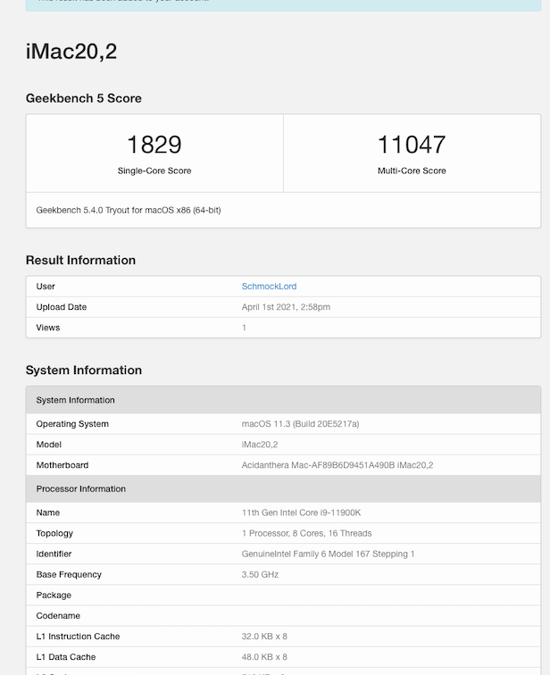

# Gigabyte-Z590i-Vision-D-11900k

Within this repository I share my Hackintosh EFI for my newest build based on Intels Rocketlake 11th Gen CPU.

# Hardware used in this build:

- CPU: Intel i9-11900k
- Board: Gigabyte Z590i Vision D:
   Audio: Realtek ALC4080
   1x 2.5Gbit Ethernet: Realtek RTL8125B-CG (requires LucyRTL8125Ethernet.kext)
   1x USB-C
   2x Thunderbolt 4 ports (Intel JHL8540 Maple Ridge)
   2x m.2 Slots
- RAM: 32GB G.Skill Trident Z 3600Mhz CL18
- eGPU: AMD Radeon Pro W5500 in a Razer Core X connected via Thunderbolt
- Wifi/BT: Intel AX201, replaced by a Broadcom BCM94360NG for macOS Compatibilty. Works out of the box. The BCM94360NG fits into the original WiFi-card housing and sits under the IO-shield. Original antennas fit.
- SSDs: 
    1x 2TB Samsung 980 Pro OEM (PM9A1) for Windows 10 (sits in the m.2 below the CPU)
    1x 1TB Samsung 960 EVO for macOS (sits on the back of the board)
- Case: NCASE M1 v6.1

# What is working:
- CPU with iMac20,2 SMBIOS, no FakeID-spoofing required. At least not on my existing macOS Big Sur 11.3 Beta 5 installation. Maybe it is required when doing a fresh install, but I doubt so.
- eGPU is working out of the box with default BIOS settings
- Audio: working out of the box as it is connected like a USB-Audio interface. But keep in mind it only shows up, when you plugin something (e.g. headphones).
- Thunderbolt 4, but no hotplug
- Wifi/BT, out of the box thanks to the BCM94360NG
- USB-ports. Have created my custom USB port mapping with USBMap.command

# What is not working:
- Thunderbolt 4 hot plugging
- iGPU, just haven't tried that, will do that next week.

# BIOS-settings:
- Current BIOS version: F5a running on Default settings. Only thing I have changed is setting Legacy USB to disabled. Internal graphics is on Auto.
