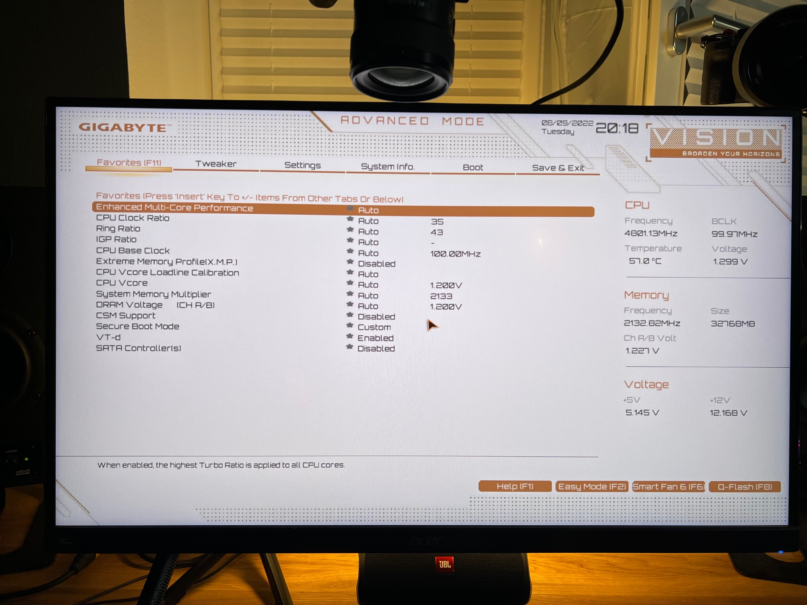
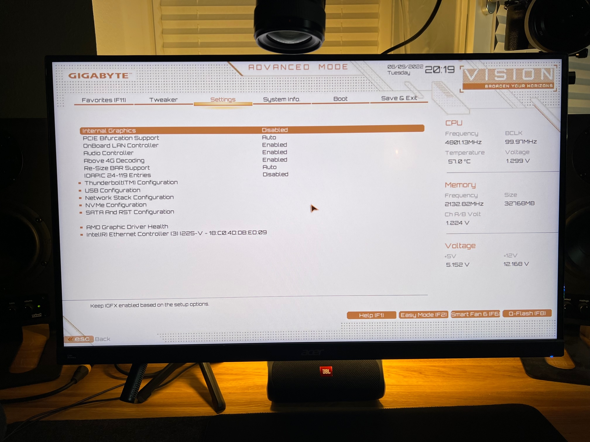
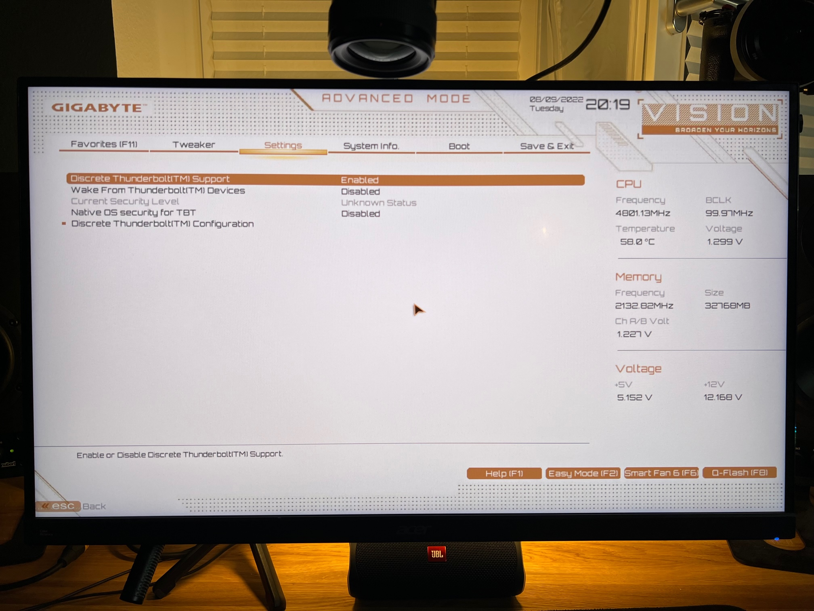
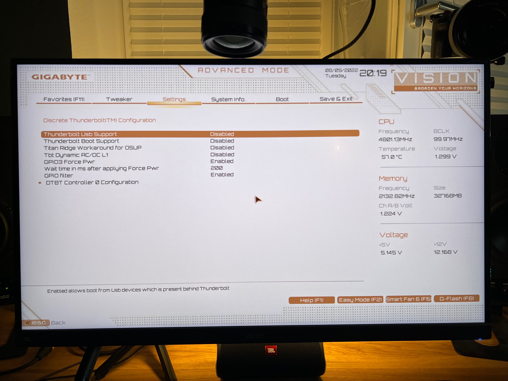
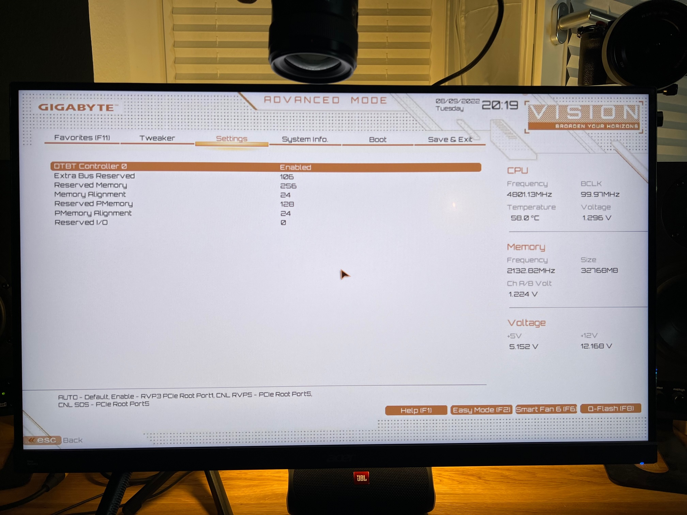
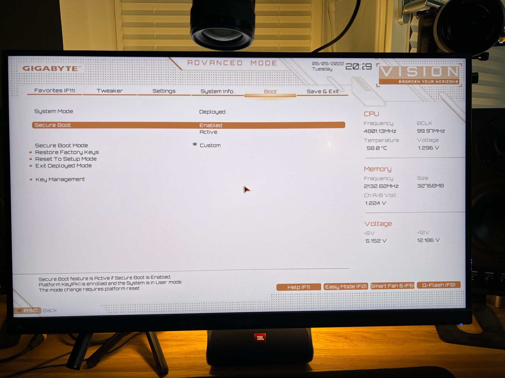
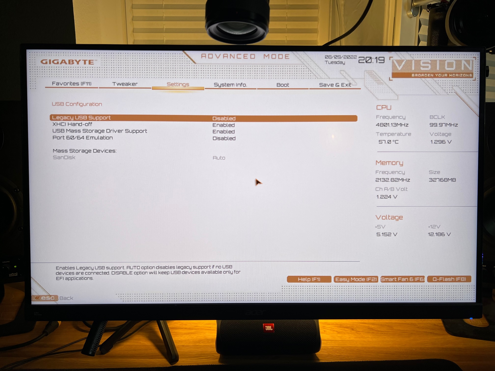
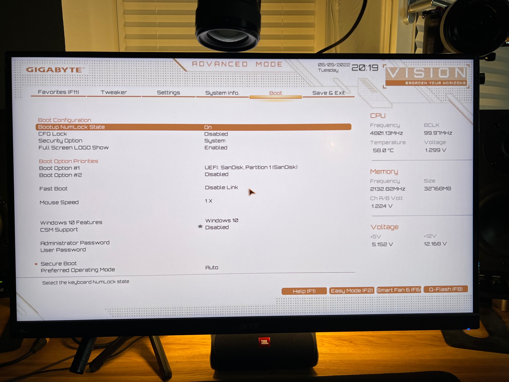

# Gigabyte-Z590i-Vision-D-11900k

Within this repository I share my Hackintosh EFI for my newest build based on Intels Rocketlake 11th Gen CPU.

  

# Hardware used in this build:

- CPU: Intel i9-11900k
- Board: Gigabyte Z590i Vision D:
  - Audio: Realtek ALC4080
  - 1x 2.5GBase-T (Intel I225-V)
  - 1x USB-C
  - 2x Thunderbolt 4 ports (Intel JHL8540 Maple Ridge)
  - 2x m.2 Slots
- RAM: 32GB G.Skill Trident Z 3600Mhz CL18
- AMD 6900XTXH (MSI Radeon RX 6900 XT Gaming Z)
- Wifi/BT: Intel AX201, replaced by a Broadcom BCM94360NG for macOS Compatibilty. Works out of the box. The BCM94360NG fits into the original WiFi-card housing and sits under the IO-shield. Original antennas fit.
- SSDs: 
    1x 2TB Samsung 980 Pro OEM (PM9A1) for Windows 10 (sits in the m.2 below the CPU)
    1x 1TB Samsung 960 EVO for macOS (sits on the back of the board)
- Case: NCASE M1 v6.1

# What is working:
- SMBIOS MacPro7,1 with full h264/h265 hardware encoding
- Audio: working out of the box as it is connected like a USB-Audio interface. But keep in mind it only shows up, when you plugin something (e.g. headphones).
- Thunderbolt 4 (incl. Hotplug, tested with Monterey 12.5 and Ventura Beta 5)
- Replacing the internal m.2 Intel Wifi with a BCM94360NG to have macOS native Wifi/BT Support
- USB-ports. Have created my custom USB port mapping with USBMap.command

# What is not working:
- iGPU, the 11th Gen iGPU is not supported by macOS

# USB Port Mapping

**Update (05.01.23): Z590 Vision D Users**
I have added a USB port configuration for the ATX version Z590 Vision D as well. You just have to disable SSDT-USB-Ports-Z590i-VisionD.aml and enable SSDT-USB-Ports-Z590-VisionD.aml.

  

# BIOS-settings:
- Current BIOS version: F8b
- **Load optimized defaults**
- Set **Above 4G Decoding** to Enabled
- Set **Legacy USB Support** to Disabled
- Set **Intel VT-D** to Enabled (DisableIOMapper is disabled, AppleVTD should be working)
- Set **Internal Graphics** to Disabled (or Auto if you want to use it in Windows)
- Thunderbolt:
  - Discrete Thunderbolt Support: Enabled
  - Wake From Thunderbolt Devices: Disabled
  - Native OS security for TBT: Disabled

  - Discrete Thunderbolt Configuration:
   - Thunderbolt USB Support: Disabled
   - Thunderbolt Boot Support: Disabled
   - Titan Ridge Workaround for OSUP: Disabled
   - Tbt Dynamic AC/DC L1: Disabled
   - GPIO3 Force Pwr: Enabled
   - Wait time in ms after applying Force Pwr: 200
   - GPIO filter: Enabled

   - DTBT Controller 0 Configuration: all Settings in this Submenu BIOS-Default
   
- For **Secure Boot**:
  - Set **Secure Boot** to Enabled
  - Set **Secure Boot Mode** to Custom
  - Go to **Key Management** and then **Enroll EFI**. 
  - Add all *.efi Files in your EFI Folder: BOOTX64.efi, all drivers(OpenRunTime.efi, OpenHFSPlus.efi, OpenCanopy.efi), OpenCore.EFI

FYI: I have XMP Profile disabled because I noticed stability issues in macOS. I am using the RAM with 2133Mhz now.

  
  
  
  
  
  
  
  

# Credits:

- [ohchang](https://github.com/dhckdgjs/GIGABYTE-Z590-VISION-G-HACKINTOSH-OPENCORE-iGPU-with-dGPU-UHD630-RX580) Your Z590 Vision G config was very helpful!
- [CaseySJ, Ori69 and vipermachine](https://www.tonymacx86.com/threads/z490-z590.308084/page-16) For the Thunderbolt 4 support!
- [Dortania](https://github.com/dortania) for this great OpenCore Desktop Guide
- [headkaze](https://github.com/headkaze) for Hackintool and our productive conversations :)
- [Acidanthera](https://github.com/acidanthera) for too many things to mention each
- [RehabMan](https://github.com/RehabMan) for too many things to mention each
- [OpenCore project](https://github.com/OpenCorePkg) for this great bootloader
