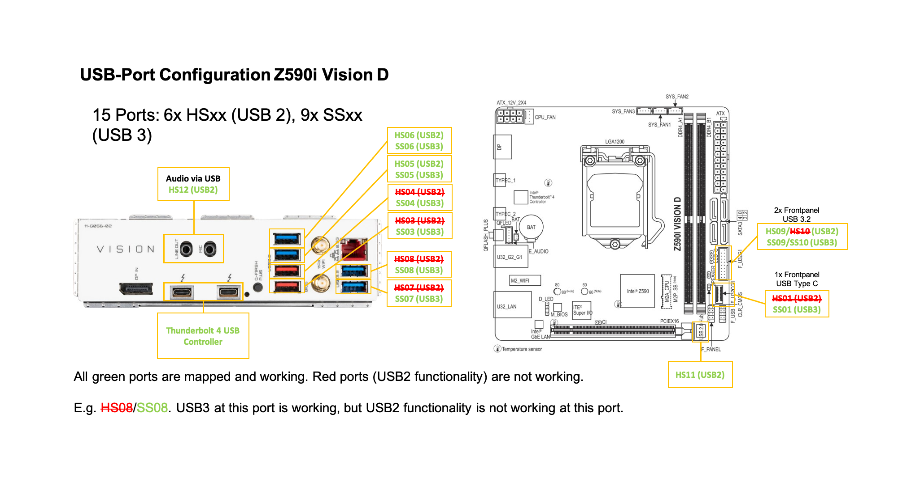
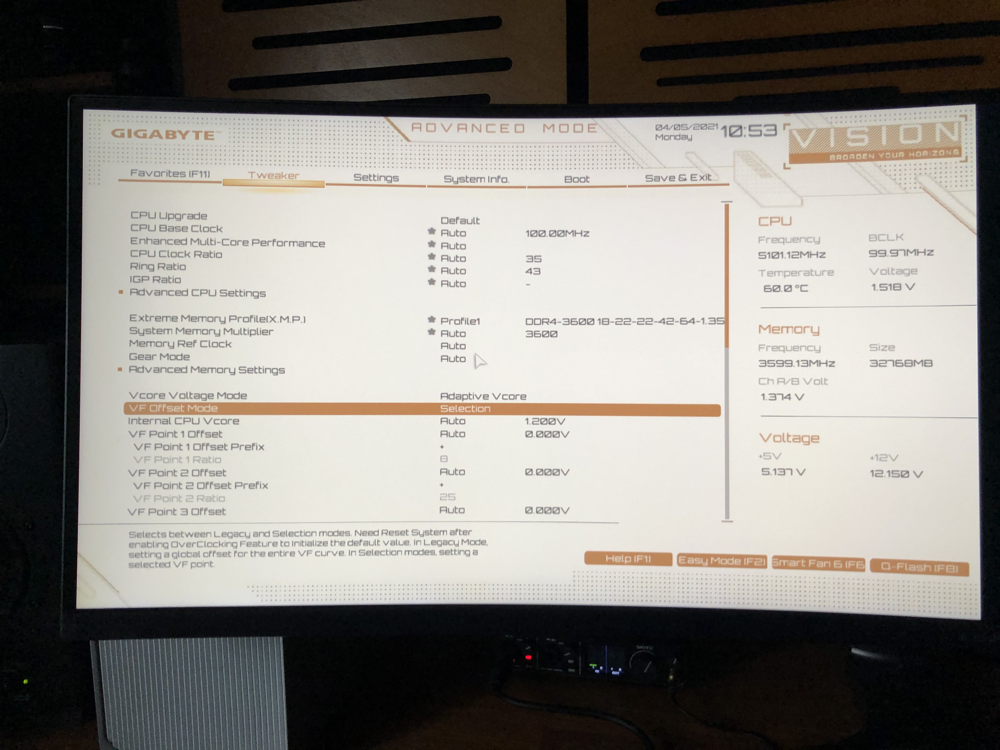
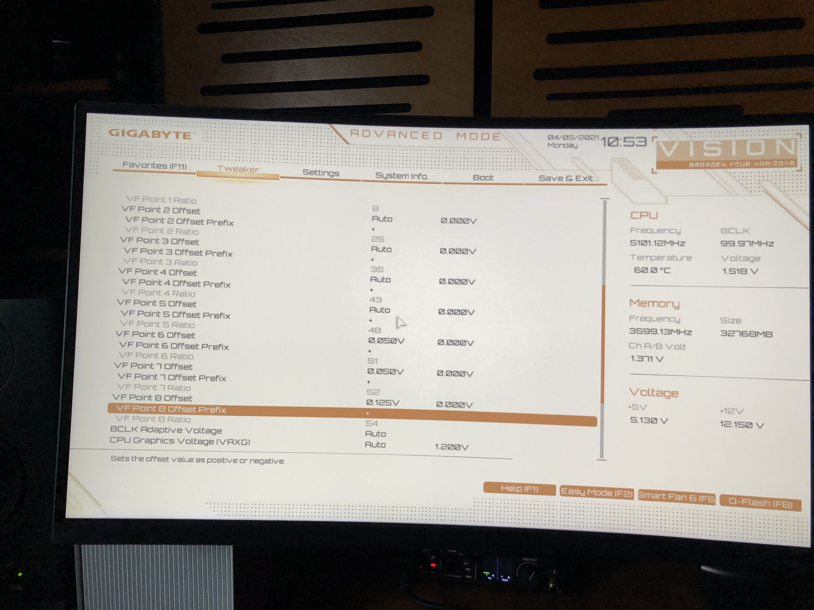
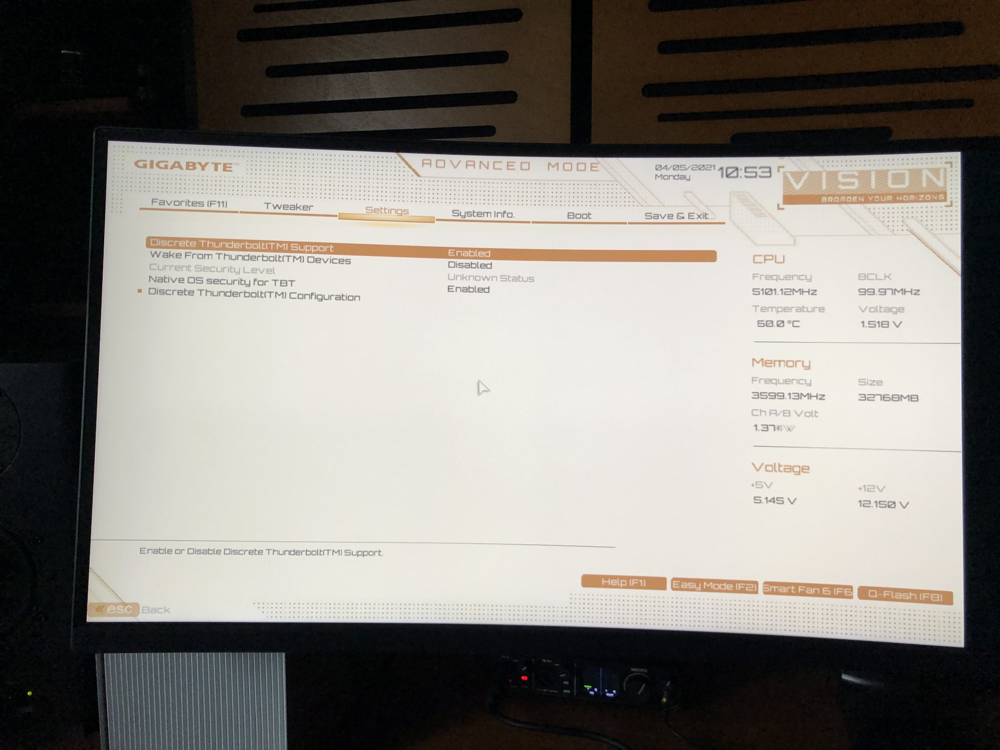
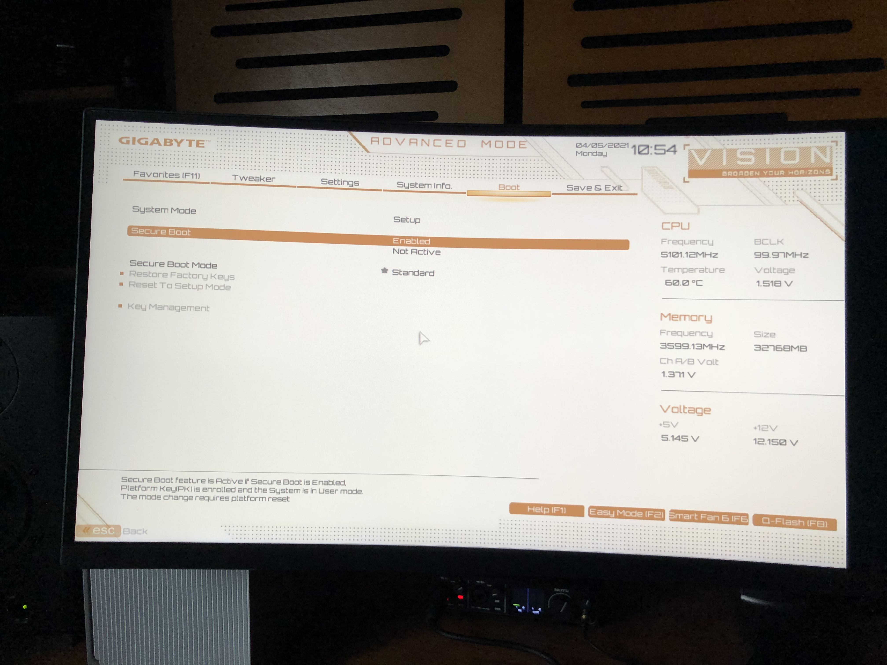
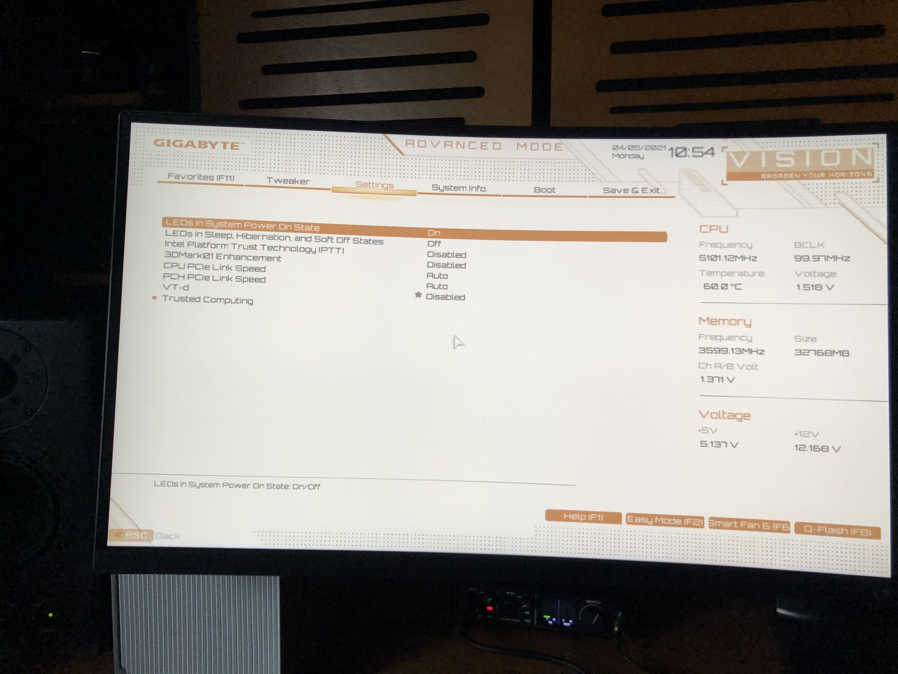

# Gigabyte-Z590i-Vision-D-11900k

Within this repository I share my Hackintosh EFI for my newest build based on Intels Rocketlake 11th Gen CPU.

  
  

# Hardware used in this build:

- CPU: Intel i9-11900k
- Board: Gigabyte Z590i Vision D:
   Audio: Realtek ALC4080
   1x 2.5Gbit Ethernet: Realtek RTL8125B-CG (requires LucyRTL8125Ethernet.kext)
   1x USB-C
   2x Thunderbolt 4 ports (Intel JHL8540 Maple Ridge)
   2x m.2 Slots
- RAM: 32GB G.Skill Trident Z 3600Mhz CL18
- eGPU: AMD Radeon Pro W5500 in a Razer Core X connected via Thunderbolt
- Wifi/BT: Intel AX201, replaced by a Broadcom BCM94360NG for macOS Compatibilty. Works out of the box. The BCM94360NG fits into the original WiFi-card housing and sits under the IO-shield. Original antennas fit.
- SSDs: 
    1x 2TB Samsung 980 Pro OEM (PM9A1) for Windows 10 (sits in the m.2 below the CPU)
    1x 1TB Samsung 960 EVO for macOS (sits on the back of the board)
- Case: NCASE M1 v6.1

# What is working:
- ~~CPU with iMac20,2 SMBIOS, currently using a Fake CPU-ID~~ Changed to SMBIOS iMacPro1,1 to enable full h264/h265 hardware encoding, until there is support for the iGPU, as the iMac-SMBIOS expect a iGPU to enable things like h264/h265.
- eGPU is working out of the box with default BIOS settings
- Audio: working out of the box as it is connected like a USB-Audio interface. But keep in mind it only shows up, when you plugin something (e.g. headphones).
- Thunderbolt 4, but no hotplug
- Wifi/BT, out of the box thanks to the BCM94360NG
- USB-ports. Have created my custom USB port mapping with USBMap.command

# What is not working:
- Thunderbolt 4 hot plugging
- iGPU, just haven't tried that, will do that next week.

# USB Port Mapping

  

# BIOS-settings:
- Current BIOS version: F5a
- Only setting you need to change, is setting '''Legacy USB''' to disabled and '''Internal graphics''' to disabled.

Here are my settings with a dynamic OC on the 11900k. 

Power Limit is set to 250W to stay within the limits of my Kraken X53 240mm AiO. In Cinebench R23 I get a maximum of 91C. Which is ok.

54 when running on 2 cores.

52 when running on 4 cores.

51 when running with more than 4 cores.

  
  
  
  
  
  
  
  
  
  
  
  
  
  
  

# Credits:

- [ohchang](https://github.com/dhckdgjs/GIGABYTE-Z590-VISION-G-HACKINTOSH-OPENCORE-iGPU-with-dGPU-UHD630-RX580) Your Z590 Vision G config was very helpful!
- [CaseySJ, Ori69 and vipermachine](https://www.tonymacx86.com/threads/z490-z590.308084/page-16) For the Thunderbolt 4 support!
- [Dortania](https://github.com/dortania) for this great OpenCore Desktop Guide
- [headkaze](https://github.com/headkaze) for Hackintool and our productive conversations :)
- [Acidanthera](https://github.com/acidanthera) for too many things to mention each
- [RehabMan](https://github.com/RehabMan) for too many things to mention each
- [OpenCore project](https://github.com/OpenCorePkg) for this great bootloader
